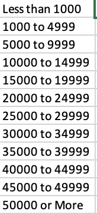
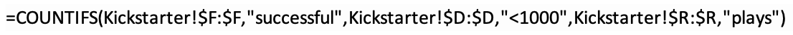
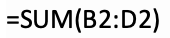
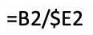
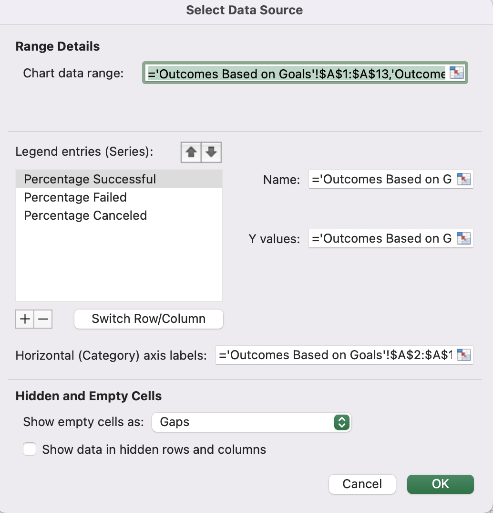

# Kickstarting with Excel

## Overview of Project

### Purpose
This analysis takes a look at Kickstarter campaigns under the plays subcategory. It's purpose is to identify possible correlations in the data which will help Louise make better decisions when it comes to managing her own campaign. This analysis specifically looks at the month the campaign was launched and funding goals to determine how these two variables may have an impact on the success rate of these types campaigns.

## Analysis and Challenges

### Analysis of Outcomes Based on Launch Date
The first step in analyzing outcomes based on launch date was to create a pivot table using parent category and years as filters. I placed outcomes in the columns section, date created in rows, and outcomes into the values section. I needed to group date created into months so that it would display months instead of years. I then created a line graph based on this pivot chart, thereby generating a visualization of the correlation between the two variables being assessed.

### Analysis of Outcomes Based on Goals
For this analysis I first needed to count the number of successful, failed, and canceled Kickstarter campaigns depending on their intitial funding goals within the plays subcategory. This meant I needed to create a series of ranges to group projects based on their goal amount. 

From here I created a series of COUNTIFS statements to display the number of successful campaigns with goals of less than 1000, goals between 1000 and 4999, and so on. 

I repeated this process to count the number of failed and canceled campaigns within each of these ranges. From here, I was able to use the SUM function in excel to calculate the total number of campaigns within each funding goal range. 

Then I created a formula to calculate percentage successful, failed, and canceled by dividing the number of successful campaigns within each funding goal range by the total number of campaigns launched in that range. 

I then created a line graph with the goal-amount ranges on the x-axis and the percentage of successful, failed, and canceled campaigns on the y-axis. 

### Challenges and Difficulties Encountered
One challenge I encountered was in grouping launch date to display month instead of year. I was able to overcome this challenge by right clicking on one of the years listed in the pivot chart, selecting grouping, and then selecting month & year instead of year and quarter. Another challenge I encountered was during the outcomes based on goals analysis. My line graph originally did not look like the example so I knew I had made a mistake or two. It turns out I entered greater than both values in a few of my COUNTIFS statements so it was only counting campaigns greater than the highest value entered rather than within the range of the two values. I also noticed that I entered an extra zero when creating the ranges within another one of my COUNTIFS statements. This just took a little bit of troubleshooting but I found the mistakes and quickly fixed them.

## Results

The first conclusion I was able to draw about the outcomes based on launch date analysis is that the highest number of successful campaigns were launched during the months of May and June. I was also able to determine that the highest number of failed campaigns were launched in May and October. This means that there are simply more campaigns being launched in May and June than any other months but does not necessarily mean that those campaigns are more likely to be succesful. However, there does appear to be a greater difference between number of successful campaigns and failed campaigns launched during these months so it is likely that campaigns launched in May and June will see greater likelihood of success.

From the outcomes based on goals analysis, it becomes clear that a campaign goal between 35000 and 44999 dollars will generate the highest probability of being both successful, and raising a large sum of money. It is to be expected that the highest percentage of successful campaigns were campaigns with a funding goal less than 1000 as that is not a difficult goal to reach but it may not be optimal for generating the largest sums of funds.

Outcomes based on launch date is limited because it only counts the number of successful, failed, and canceled campaigns during each month rather than displaying a percentage successful vs percentage failed. This makes it harder to understand which month would actually be better to launch a campaign. Outcomes based on goals is limited because it only tells us which goal amount ranges are more likely to be successful. Success, in this case, is based on whether or not the campaign reached their goal and not on how much money the campaign raised in relation to other campaigns. This makes it difficult to determine which launch date or funding goal is actually optimal for raising the largest amount of money. On top of this, there are definitely a whole slew of other variables affecting campaign outcomes which are not being taken into account in the dataset. These unlisted variables may even be affecting the variables we do have values for so it can be difficult to draw any real conclusions from this data.

We could create a graph displaying the percentage of successful campaigns out of total campaigns launched during each month to get a better idea of which launch date is actually more likely to produce a successful outcome. We could also create a graph demonstrating the correlation between funding goal and amount of money raised as a opposed to outcome. This would give us a better idea of which funding goal range would help Louise meet her own personal funding goal. Campaigns with goals less than 1000 are undoubtedly the most likely to result in a successful outcome but that doesn't necessarily mean that a goal that small would help Louise raise the money she needs to fund her project.
